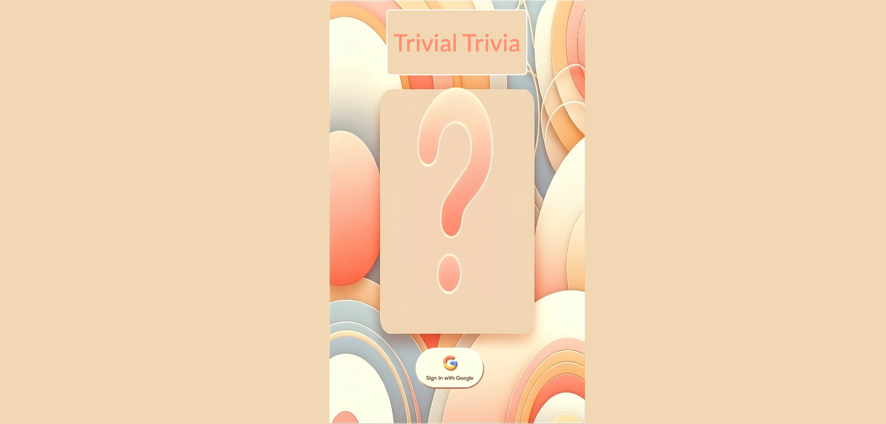
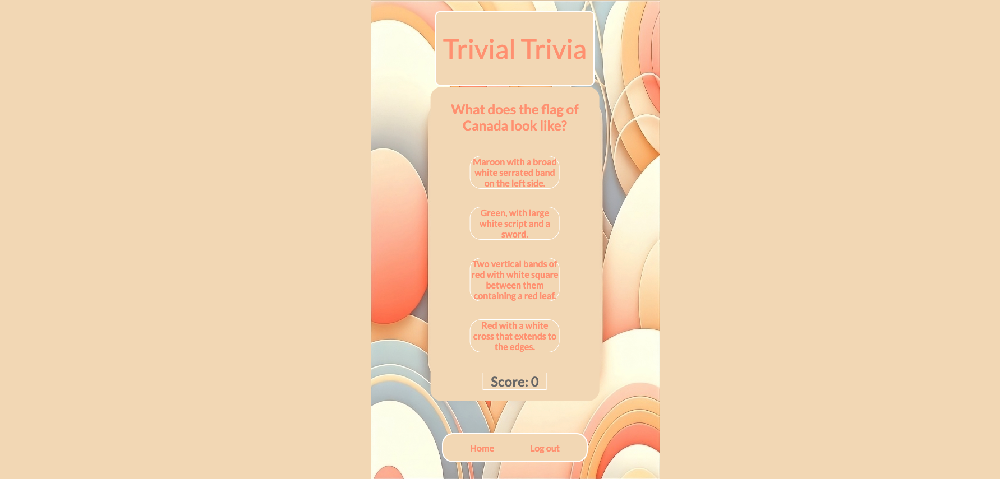

markdown
Copy code
# Trivial Trivia
Trivial Trivia is an interactive quiz game that challenges players on various topics, providing educational fun and a competitive twist.

## User Flow(s)

Start by selecting a difficulty and cateogry. Answer questions to earn points. Use the Nav bar to log out or go home to start a new game

## Technologies Used
- React.js
- Auth0
- Node.js
- Express
- MongoDB
- CSS

## Getting Started
- [Deployed App](https://dreamy-sundae-fbc7da.netlify.app/)
- [Trello Board](https://trello.com/b/5v6nQg2V/project-3-planning)

## Next Steps
Future enhancements include:
- Sound effects for answers.
- Background music.
- Performance tracking and history.